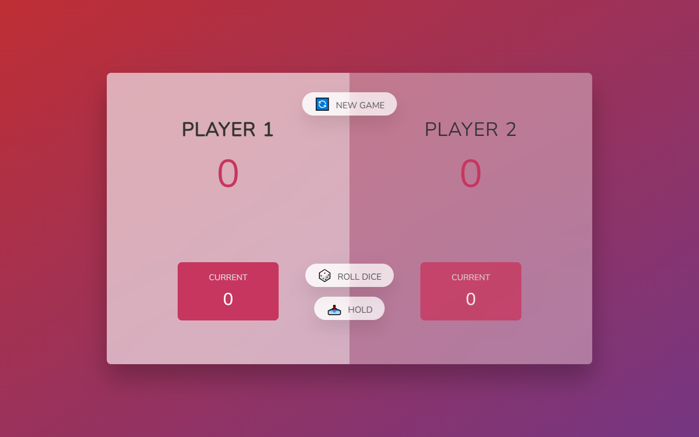

<h1 align="center"> 
    Pig Game   
    

    
</h1>

<h4 align="center"> 
	🚧 Pig Game 🟢 Concluído 🚀 🚧
</h4>

<!-- 

 <a href="#-Projeto">Sobre</a> •
 <a href="#-funcionalidades">Funcionalidades</a> •
 <a href="#-descricao">Descrição</a> •
 <a href="#-layout">Layout</a> •
 <a href="#-tecnologias">Tecnologias</a> •
 <a href="#-autor">Autor</a>

 -->

- [Project](#project)
- [About](#about)
- [Functionalities](#functionalities)
- [Technologies](#technologies)
- [Author](#author)

---

## **Project**

_Pig Game_ - A game developed with HTML, CSS and Vanilla JS.

&nbsp;

## **About:**

This game was developed on Jonas Schmedtmann's JavaScript course to practice DOM Manipulation, the game can be played with 2 players, if one of the players reaches 100 points or more, he wins the game..

---

## **Functionalities**

- [x] Button to rotate data(ROLL DICE)
- [x] Button to save current points(HOLD)
- [x] Reset game button(NEW GAME)

---

<!-- ### Mobile

  
    

 -->
<!--
### Tablet

   
     

 -->

## **Preview Site**

- [Netlify](https://vinicius-pig-game.netlify.app)

---

## **Technologies**

The following tools were used in building the project:

#### **Website**

- **[HTML]()**
- **[CSS]()**
- **[Vanilla JS JavaScript]()**

---

## **Author**

<a href="https://www.frontendmentor.io/profile/viniciusshenri96">
  <!--  -->
 <h2 style="font-style: normal; color:">Vinícius Henrique</>
   
 </a>

<!--   -->

<!-- ## 📝 Licença

Este projeto esta sobe a licença [MIT](./LICENSE).

Feito com ❤️ por Thiago Marinho 👋🏽 [Entre em contato!](https://www.linkedin.com/in/tgmarinho/)

---

## Versões do README

[Português 🇧🇷](./README.md) | [Inglês sem emojis 🇺🇸](./README-en.md) | [Portugues sem logo 🇧🇷](./README-sem-logo.md) -->
